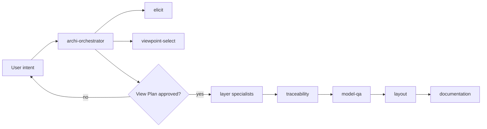

<!-- Copyright (c) 2026 JG Systems Consulting Ltd. See LICENSE. -->
<!-- SPDX-License-Identifier: LicenseRef-JGSC-Proprietary -->

# jgs-archi-skills

<p align="center">
  
  
  
  
  
  
</p>

Agent-guided ArchiMate viewpoint creation in Archi: a skill suite that drives
the existing JGS Archi Bridge MCP (consume-only). One orchestrator plus twelve
specialists. Archi is the only canvas. MCP resources are the sole ArchiMate
reference.

## Prerequisites

- Archi with the JGS Archi Bridge plugin
- MCP endpoint (default): see [docs/MCP.md](docs/MCP.md)
  (`http://127.0.0.1:18090/mcp`, 69 tools, 14 resources)
- Python 3.10+ (standard library only; no pip packages required)

## Install

```bash
python install.py
```

Installs each `skills/<name>/` package that contains `SKILL.md` into
`~/.zcode/skills/<name>/` (flat). That default is the binding delivery form.

```bash
python install.py --dry-run
python install.py --agent claude          # ~/.claude/skills/jgs/<skill>/
python install.py --agent all
python install.py --list-agents
python install.py --link                  # symlink when the OS allows
```

Wrappers: `install.sh`, `install.ps1`. Other hosts: [docs/other-agents.md](docs/other-agents.md).

### Install with your AI agent

Copy this prompt into your coding agent (ZCode, Claude Code, Cursor, etc.):

```text
Install jgs-archi-skills v1.0.0 from https://github.com/jgsystemsconsulting/jgs-archi-skills.
1. Read README.md and docs/skill-usage.md first.
2. Check prerequisites: Archi + JGS Archi Bridge MCP on http://127.0.0.1:18090/mcp, Python 3.10+.
3. Run `python install.py --dry-run`, then `python install.py` (ZCode, flat ~/.zcode/skills).
   For Claude Code instead: `python install.py --agent claude`.
4. Verify each skills/*/SKILL.md landed under the target and the count matches SKILLS.md (13).
5. Note the proprietary licence in LICENSE before use.
Flag any step you cannot perform.
```

## Usage

Invoke the orchestrator from your skill runner:

```text
/archi-orchestrator <plain-language intent>
```

The orchestrator elicits intent, drafts a schema-checked view plan, grounds
viewpoints, and (after your approval) dispatches layer specialists,
traceability, QA, layout, and documentation. Specialists are
orchestrator-dispatched, not user-invoked.



How to invoke and first-run details: [docs/skill-usage.md](docs/skill-usage.md).
Skill index: [SKILLS.md](SKILLS.md).

## Licence

Proprietary. Copyright (c) 2026 JG Systems Consulting Ltd. See
[LICENSE](LICENSE). Free of charge to use; not open source. No right to copy,
modify, or redistribute except the local install described in the licence.

## Support

Bugs: open a GitHub issue using the bug-report form. Security: see
[SECURITY.md](SECURITY.md) (private advisory; do not open a public issue).

## Tests

```bash
python -m unittest discover -s tests -q
```

Tests cover the helpers, specialist contracts, installer, and offline
fixtures. They never call the MCP. Live checks are opt-in via
`python tests/live_mcp_smoke.py` (requires Archi + Bridge running).

## Structural validation

```bash
python helpers/validate_skill_mcp_refs.py
```

Fails if any skill cites an MCP tool or `archimate://` resource not listed
in `docs/mcp/archi-bridge-inventory.json`.

## Layout

| Path | Role |
|------|------|
| `skills/` | Skill packages (`SKILL.md` each) |
| `helpers/` | Stdlib validators, checkers, and matrices |
| `docs/MCP.md` | Endpoint + consume-only contract |
| `docs/skill-usage.md` | How to invoke after install |
| `docs/other-agents.md` | Per-agent install targets |
| `docs/CREATE_PATH.md` | Shared specialist modelling contract |
| `VISION.md` | Product objectives and non-goals |
| `CHANGELOG.md` | Milestone history |

## Version

v1.0.0. See [CHANGELOG.md](CHANGELOG.md).
