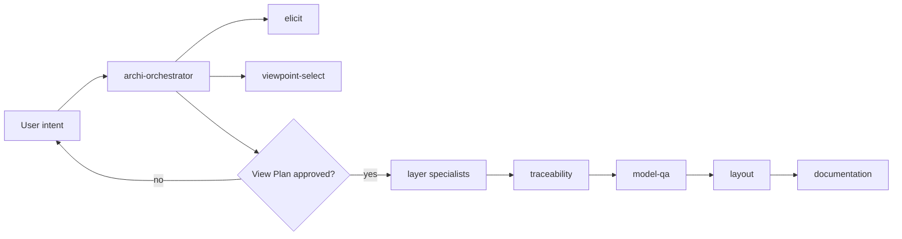

<!-- Copyright (c) 2026 JG Systems Consulting Ltd. Source: https://github.com/jgsystemsconsulting/jgs-archi-skills. See LICENSE. -->
<!-- SPDX-License-Identifier: MIT -->

# jgs-archi-skills

<p align="center">
  
  
  
  
  
  
</p>

**Sign the view plan. Archi stays the system of record.**

Delivery ships weekly. Architecture views lag by sprints. SOAM is a governed
run in Archi: plain-language intent, a view plan you approve, then specialists
write only the layers you named. Traceability, QA, layout, and documentation
sit on the path. The ArchiMate language stays in the MCP bridge, not in the
prompt. You still own the architecture.

```text
/archi-orchestrator invoice-to-cash capability map for finance and ops
/archi-orchestrator manufacturing plant: as-is shop floor and the CRM programme that is supposed to fix order visibility
/archi-orchestrator move the legacy TMS to a cloud landing zone; plateaus and work packages only. Do not redesign the business.
```

Paste-install (Bridge + skills) is below. Practice write-up:
[docs/papers/ieee/soam-ieee-software.pdf](docs/papers/ieee/soam-ieee-software.pdf).
Landing copy and talk abstract: [docs/papers/landing.md](docs/papers/landing.md).

Agent-guided ArchiMate viewpoint creation in Archi: a skill suite that drives
the existing JGS Archi Bridge MCP (consume-only). One orchestrator plus twelve
specialists plus the jgs-upstream-feedback utility. Archi is the only canvas.
MCP resources are the sole ArchiMate reference.

## Prerequisites

- Archi with the JGS Archi Bridge plugin
- MCP endpoint (default): see [docs/MCP.md](docs/MCP.md)
  (`http://127.0.0.1:18090/mcp`, 69 tools, 14 resources)
- Python 3.10+ (standard library only; no pip packages required)

## Install

```bash
python install.py --agent all
```

Installs each `skills/<name>/` package that contains `SKILL.md` into the
user-global hosts (ZCode, Claude Code, OpenAI Codex, GitHub Copilot CLI,
OpenClaw, Gemini CLI). Cursor is project-local:

```bash
python install.py --agent cursor          # ./.cursor/rules/<skill>.mdc
python install.py --dry-run
python install.py --agent claude          # ~/.claude/skills/jgs/<skill>/
python install.py --list-agents
python install.py --link                  # symlink when the OS allows
```

Bare `python install.py` still writes the ZCode folder. Wrappers:
`install.sh`, `install.ps1`. Paths: [docs/other-agents.md](docs/other-agents.md).

### Install with your AI agent

This pack needs the JGS Archi Bridge running inside Archi. Copy the prompt below into your coding agent (ZCode, Claude Code, Cursor, or similar). It reads both READMEs and installs the plugin and the skills.

The same prompt lives in the [JGS Archi Bridge README](https://github.com/jgsystemsconsulting/jgs-archi-mcp).

```text
Install and set up JGS Archi Bridge (MCP) and jgs-archi-skills. Read each README and follow it. Do not invent steps.

Repositories:
1. JGS Archi Bridge (Archi MCP plugin): https://github.com/jgsystemsconsulting/jgs-archi-mcp
2. jgs-archi-skills (agent skill pack): https://github.com/jgsystemsconsulting/jgs-archi-skills

Do this in order.

A. Bridge (MCP)
- Read that repo's README.md.
- Prerequisites: Archi 5.7+, Java 21+.
- Install the plugin as the README says: download the latest .archiplugin from Releases (or bin/), then in Archi use Help > Manage Plug-ins > Install New..., or copy it into Archi's dropins/ folder.
- Restart Archi.
- Open an ArchiMate model, then start the server: MCP Server > Start MCP Server.
- Default endpoint: http://127.0.0.1:18090/mcp
- Wire this agent to that endpoint using the README section for this host (ZCode, Claude Code CLI, Claude Desktop, Cline, or other). Example for Claude Code:
    claude mcp add --transport http archi http://127.0.0.1:18090/mcp
- Leave bind, TLS, and auth at README defaults unless the user asked otherwise.

B. Skills
- Clone or fetch https://github.com/jgsystemsconsulting/jgs-archi-skills
- Read README.md and docs/skill-usage.md. If the host is not ZCode, also read docs/other-agents.md.
- Prerequisites: Python 3.10+ (stdlib only; no pip packages), Archi + Bridge already running.
- Detect the agent host and install:
    python install.py --dry-run
    python install.py                  # ZCode → ~/.zcode/skills/<skill>/
    python install.py --agent claude   # Claude Code → ~/.claude/skills/jgs/<skill>/
  Use --agent all only if the user wants every supported host. Wrappers: install.sh, install.ps1.
- Confirm 14 skills landed (count matches SKILLS.md). Flag any step you cannot perform.
- Note the MIT licence in LICENSE.

C. Tell the user when you finish
- Restart Archi if the plugin was just installed.
- Fully restart this agent session (ZCode, Claude Code, Cursor, or other) so it rediscovers skills and the MCP server. Quit and reopen the agent if skills or MCP tools do not appear.
- Confirm Archi has a model open and the MCP menu shows Stop MCP Server (server is running).
- How to run: /archi-orchestrator <plain-language intent>
  Example: /archi-orchestrator invoice-to-cash capability map for finance and ops
- Do not invoke layer specialists yourself. The orchestrator dispatches them after plan approval.

If a step fails (plugin missing, port 18090 in use, Python missing, skills count wrong, MCP not listed), stop and report the exact failure and the README section that applies. Do not modify jgs-archi-mcp source.
```

## Usage

Invoke the orchestrator from your skill runner:

```text
/archi-orchestrator <plain-language intent>
```

The orchestrator elicits intent, drafts a schema-checked view plan, grounds
viewpoints, and (after your approval) dispatches layer specialists,
traceability, QA, layout, and documentation. Specialists are
orchestrator-dispatched, not user-invoked.

Starter prompts (copy one line): [docs/prompts/README.md](docs/prompts/README.md).

```text
/archi-orchestrator invoice-to-cash capability map for finance and ops
/archi-orchestrator Northridge and Vale insurance merger: current vs target customer onboarding, with a migration roadmap
/archi-orchestrator manufacturing plant: as-is shop floor and the CRM programme that is supposed to fix order visibility
/archi-orchestrator on the current model, add a second CRM for the European branch and show impact; do not duplicate shared customer data
/archi-orchestrator move the legacy TMS to a cloud landing zone; plateaus and work packages only. Do not redesign the business.
/archi-orchestrator board pack: drivers, goals, and outcomes for cutting quote time from 4 hours to 30 minutes. No applications.
```



Interactive diagrams (Archify):
[cooperation](https://jgsystemsconsulting.github.io/jgs-archi-skills/diagrams/cooperation.html)
and
[modelling run](https://jgsystemsconsulting.github.io/jgs-archi-skills/diagrams/modelling-run.html).

Companion site: [hub](https://jgsystemsconsulting.github.io/jgs-archi-skills/),
[layer guide](https://jgsystemsconsulting.github.io/jgs-archi-skills/guide.html),
and [engagement](https://jgsystemsconsulting.github.io/jgs-archi-skills/engage.html).

Pack defects that any user would hit can be raised from the session (orchestrator
offers, or `/jgs-upstream-feedback`). Local model issues stay local.

How to invoke and first-run details: [docs/skill-usage.md](docs/skill-usage.md).
Skill index: [SKILLS.md](SKILLS.md).

## Licence

MIT. Copyright (c) 2026 JG Systems Consulting Ltd. See [LICENSE](LICENSE).
Fork, customise skills, and redistribute under the same terms. See
[CONTRIBUTING.md](CONTRIBUTING.md).

To request a commercial or academic licence for JGSC Labs products, or if you
are unsure which licence you need, see
[labs.jgsystemsconsulting.com/licensing.html](https://labs.jgsystemsconsulting.com/licensing.html).

## Support

Bugs: open a GitHub issue using the bug-report form. Pack improvements: skill-improvement
form, or yes on an in-session draft. Questions and worked runs:
[Discussions](https://github.com/jgsystemsconsulting/jgs-archi-skills/discussions).
Bridge defects: jgs-archi-mcp issues, not this tracker. Security: see
[SECURITY.md](SECURITY.md) (private advisory; do not open a public issue).
Product and support email: support@jgsystemsconsulting.com.

## Tests

```bash
python -m unittest discover -s tests -q
```

Tests cover the helpers, specialist contracts, installer, and offline
fixtures. They never call the MCP. Live checks are opt-in via
`python tests/live_mcp_smoke.py` (requires Archi + Bridge running).

## Structural validation

```bash
python helpers/validate_skill_mcp_refs.py
```

Fails if any skill cites an MCP tool or `archimate://` resource not listed
in `docs/mcp/archi-bridge-inventory.json`.

## Layout

| Path | Role |
|------|------|
| `skills/` | Skill packages (`SKILL.md` each) |
| `helpers/` | Stdlib validators, checkers, and matrices |
| `docs/MCP.md` | Endpoint + consume-only contract |
| `docs/skill-usage.md` | How to invoke after install |
| `docs/prompts/` | Starter invoke lines and frozen use-case cards |
| `docs/other-agents.md` | Per-agent install targets |
| `docs/CREATE_PATH.md` | Shared specialist modelling contract |
| `CHANGELOG.md` | Milestone history |

## Version

v1.0.0. See [CHANGELOG.md](CHANGELOG.md).
