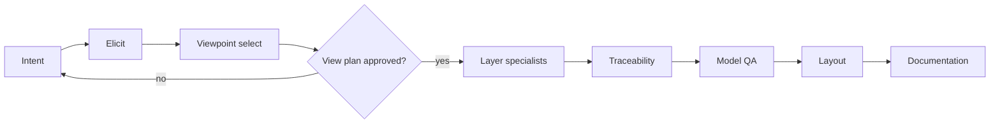

<!-- Copyright (c) 2026 JG Systems Consulting Ltd. See LICENSE. -->
<!-- SPDX-License-Identifier: MIT -->

# Keeping Architecture on Cadence: Skill-Orchestrated ArchiMate Modelling in the System of Record

JG Systems Consulting Ltd

*IEEE Software practice draft. Markdown working copy; not a venue submission. Target: IEEE Software feature / practice article, two-column IEEE, about 6 pages.*

**Keywords:** enterprise architecture, ArchiMate, Archi, modelling tools, large language models, Model Context Protocol, human in the loop

## Abstract

Delivery teams ship weekly. Architecture views lag by sprints. The lag is not a shortage of ArchiMate or of Archi: the modelling method lives in the architect's head and the tool is a canvas. Skill-Orchestrated ArchiMate Modelling (SOAM) is a governed pipeline: an orchestrator elicits intent and a view plan, the architect approves, then specialists write only into Archi through an MCP bridge. The language stays in MCP resources. Two author-run frozen briefs demonstrate the pipeline: a mill CRM programme that must not absorb the MES (Hatherley Plate), and a training-range planning tool that must not absorb the GCS or the airborne computer (Moorfield Range). The defence is demonstration, not timing. The claim is method, not a speedup percentage.

## Current practice

Enterprise architecture is supposed to be the system of record for change. In an engineering organisation it often is not. The architect runs a workshop, chooses a viewpoint without recording the choice, and places boxes in Archi for days. Review finds the wrong cut. The rationale ends up in slides the model never holds.

ISO/IEC/IEEE 42010 already said stakeholders get viewpoints [1]. ArchiMate defined them [2]. Archi holds a real model [3]. None of that executes the method. Last week's view gets copied. Correspondence across motivation, capability, application, technology, and work package is optional labour dropped first under deadline. Documentation is a second artefact.

Language-model tools do not fix this if they emit PlantUML, JSON, or a picture beside the model [4], [5]: the organisation's Archi file is unchanged, the metamodel is approximated in a prompt, and current models handle metamodels unreliably [6]. The same pattern now covers ArchiMate itself [7]. The architect is asked to approve a drawing after the fact.

SOAM is architect-governed, system-of-record native, and MCP-instrumented: plain-language intent in, view plan as a gate, specialists only for named layers, writes through a local MCP bridge into Archi [8], [9], [10]. Coding-agent hosts (ZCode, Claude Code) are runtime, not the product.

We do not claim ArchiMate is incomplete, or that architects are slow. Given ArchiMate and Archi, dominant practice does not instrument the method, so architecture cannot keep cadence with engineering. Throughput is why engineering organisations should care. It is not a measured result.

## Tool-as-canvas waste

Current practice loses time in recurring ways; this section names them. Table 1 lists each waste against the SOAM stage built for it.

| Waste | What it costs | SOAM stage |
|---|---|---|
| Viewpoint chosen from habit | Wrong audience, overloaded diagrams, rework | Viewpoint select and view-plan approval |
| Elicitation decoupled from modelling | Notes go stale; review finds the wrong scope | Elicit, then plan; no mutate yet |
| Drawing as the main effort | Allowed relations live in the modeller's head | Layer specialists via MCP |
| Cross-layer traces optional | Motivation to mill equipment breaks first | Traceability |
| Docs as a second artefact | Rationale in slides; model becomes pictures | Documentation fields in the model |
| Language not executable | Juniors invent illegal relations; seniors lint | MCP resources and model QA |

Table 1. Tool-as-canvas waste and the pipeline stage that addresses it.

SOAM runs elicit, plan, model, QA, and document as one governed run. Table 1 supports the cycle-time claim. No timing was done.

## The method

SOAM is a method: an orchestrator, twelve specialists, and a consume-only MCP bridge into Archi [9], [10]. The language is not in the skills.

### Five rules

1. **The user governs.** Input is plain-language intent. Specialists do not mutate until the architect approves a view plan naming views, stakeholders, concerns, and layer specialists. The architect can reject and return to elicitation with no half-written model. A refused redesign is method behaviour, not failed generation.

2. **The orchestrator composes; specialists execute.** Elicitation and viewpoint selection run first; only named layers are dispatched; the user does not invoke layer skills. A capability cut does not silently grow a technology view. A landing-zone move does not invent a new operating model to justify the diagram.

3. **Archi is the only canvas.** Elements, relations, views, and documentation fields are written through MCP. No parallel diagram. No PlantUML as the deliverable. Specialists re-query identifiers, reuse existing elements where names match, and surface ambiguous near-matches instead of silent merges.

4. **The language stays in MCP resources.** Skills orchestrate tools and resources and do not embed the ArchiMate metamodel, which current models handle unreliably [6]. A structural check stops a skill citing a tool absent from the bridge. If the language changes in Archi, skills do not carry a stale copy.

5. **Correspondence is a stage.** Traceability runs after layer specialists; quality assurance, layout, and documentation are terminal. Created elements carry an evidence line (stated, inferred, or existing) in the documentation field. The first generation ends at a draft checkpoint. Completing a specialist does not finish the model.

A prompt that says "draw ArchiMate" has none of these rules.

### Pipeline

Figure 1 shows the run: elicit intent, draft viewpoint selection, gate on the view plan; rejection returns to intent; approval dispatches only named layer specialists, then traceability, model QA, layout, and documentation.

Figure 1. SOAM pipeline. Nothing mutates until the view plan is approved. Trace, QA, layout, and documentation run after the named layer specialists.

Layer specialists: motivation, capability and strategy, business, application, technology and physical, implementation and migration. The mill CRM brief includes motivation plus technology and physical, and omits implementation and migration. The range brief does the same and also refuses SysML and an air-vehicle product structure. Dispatch follows the plan.

Two contract gates: no mutating MCP call unless the view plan is approved; the documentation specialist ends at a draft. Completing a specialist does not present the model as finished.

The user invokes only the orchestrator. Specialists: elicit, viewpoint-select, motivation, capability and strategy, business, application, technology and physical, implementation and migration, traceability, model-qa, layout, documentation. Elicit and viewpoint-select do not mutate.

### The bridge is not the contribution

The JGS Archi Bridge runs inside Archi and exposes HTTP MCP at `http://127.0.0.1:18090/mcp` by default [8], [10]. Offline inventory: 69 tools, 14 resources. Skills consume those only; they never modify the bridge or copy ArchiMate language tables into skill text. They read `archimate://reference/*` and `archimate://recipes/*` from the MCP. Archi 5.7 or later is the surface [3], [9].

MCP makes the system of record agent-operable [8]; SOAM supplies the method on that surface. If the protocol is the lead, this is a connector note. Engineers should care about the gate and the canvas, not the port number.

jgs-archi-skills v1.0.0 is MIT [9]. Helpers are Python 3.10 standard-library validators, not a modelling engine. Skills are stateless. Rationale lives in Archi documentation fields. Live MCP is an opt-in smoke path, not evidence for this article.

## Two walks

Both walks were executed by the authors in Archi 5.7+ through the JGS Archi Bridge. Neither is a timed client engagement. Working models live in https://github.com/jgsystemsconsulting/jgs-archi-skills-we.

### Hatherley Plate: OrderSight must not absorb MillOS

Hatherley Plate is a UK plate mill. Production runs on MillOS (MES) and WorksERP; sales still track promises on PromiseSheet. OrderSight is funded for order visibility. Plant engineers worry OrderSight will be drawn as if it replaces MillOS. Stakeholders: plant manager, head of sales, MES owner, CRM programme manager, operations planner, integration lead. In: motivation for visibility, capabilities, production operations, applications, technology nodes, physical equipment or facility. Out: work-package roadmap, product costing, greenfield MES rewrite. Target: mill equipment and MillOS still visible; OrderSight sales-facing, served by PlantGate; shared order identity, not one merged blob.

Views: Motivation Overview, Capability Map, Production Operations, Application Support, Technology and Physical. Specialists: elicit, viewpoint-select, motivation, capability-strategy, business, application, technology-physical, traceability, model-qa, layout, documentation. Pass checks: listed views; OrderSight and MillOS remain separate applications; WorksERP, PromiseSheet, and PlantGate stay distinct; at least one facility or equipment element on a mill-floor node; confirmation gate before mutate.

This is the engineering-organisation case: a funded programme collides with mill operations. If OrderSight is drawn as the system that runs the mill, the model would be used against the plant. The method must keep OrderSight and MillOS separate, keep mill equipment on a node, and still show PlantGate in the comms room. Pictures of the five views sit on `hatherley.html`. Author-run frozen firm, not a client model.

Motivation is in for visibility; technology and physical are in for mill equipment and PlantGate; implementation and migration are out because the brief forbids a work-package roadmap. If OrderSight absorbs MillOS on the canvas, the run failed even if the diagram has many elements. Modelling every layer would add a migration plateau the brief excluded. Dispatch keeps that plateau off the plan.

### Moorfield Range: RangePlan must not absorb GroundOS or AirStack

Hawker Range Systems Ltd runs one UK training range at Moorfield. Instructors still track sorties on SortieBoard. RangePlan is funded for sortie visibility. The plant analogue: RangePlan must not be drawn as GroundOS (GCS software) or as AirStack (airborne mission computer). Stakeholders: range manager, chief instructor, GCS owner, planning programme manager, sortie planner, integration lead. In: motivation for visibility, capabilities, range operations, applications, technology nodes, physical equipment or facility. Out: work-package roadmap, second site, GroundOS rewrite, weapons, ERP, air-vehicle SysML. Target: RangePlan, GroundOS, and AirStack stay separate; shared sortie identity, not one merged blob; LinkGate bridges tasking to GroundOS and does not talk to the air vehicle.

Views: Motivation Overview, Capability Map, Range Operations, Application Support, Technology and Physical. Specialists match the mill cut: motivation and technology-physical in; implementation and migration out. Pass checks: listed views; RangePlan, GroundOS, and AirStack remain separate applications; at least one facility or equipment element on a node; air vehicle not modelled as product structure; SysML stays off this canvas; confirmation gate before mutate.

Moorfield is the refuse-scope walk: dispatch does not invent SysML, a work-package plateau, or a merged blob. Pictures are not on `hatherley.html`; the working model is in the same we-repo named in the section opener. Author-run frozen firm, not a client model.

### Integrity checks

A structural validator in the skill pack checks skill files cite only tools and resources in the bridge inventory. On the v1.0.0 pack it reports fourteen skill files and zero unknown references. That warrants the tool-cite claim, not modelling quality.

The copy-free language contract is policy, not a validator result: skills consume MCP tools and resources only and never copy ArchiMate language tables into skills. Confirm-before-mutate is a method gate. These are integrity properties of the implementation.

## What this is not

Cámara et al. assessed ChatGPT on UML tasks and reported mixed reliability outside a controlled prompt [4]. Fill, Fettke, and Köpke reported conceptual-modelling experiments in which models emit plausible diagrams that are not the organisation's model [5]. Surveys cover the line: Di Rocco et al. map it across model-driven engineering [12]; a BISE editorial names generative conceptual modelling a research direction [13]. The line includes ArchiMate generation from natural language [7] and multi-agent enterprise-architecture design [14]. All generate a parallel artefact: metamodel copied or approximated in the prompt, system of record unchanged.

SOAM writes into Archi. Language source of truth stays in MCP resources. Architect approval of a view plan is a method rule, not a UI confirm on a generated picture. MCP is the tool protocol those agents can speak [8]; it is not a modelling method.

Lankhorst remains the working-practice account of enterprise architecture [15]. Moody still shows that views fail as communication when graphic economy is ignored [16]. SOAM does not replace those. Layout and QA sit on the critical path because drawing quality is how the model is read, not because a check after modelling is enough.

## Limits and adoption

SOAM is built so a shop that already runs Archi can install it: MIT skills, no second EA suite, architect on the gate. That is a design choice, not evidence of uptake. Treating design-for-adoption as a finding would overstate the evidence.

Both walks are author-run Archi models, not client engagements. They show coverage, not organisational uptake. Starter prompts for invoice-to-cash and a landing-zone refuse exist in the skill pack and are not this paper's evidence. The implementation is one bridge, one skill suite, Archi only; the argument does not generalise to Sparx or LeanIX. Language-model output is non-deterministic: the same intent can yield different element names. Governance (approval gate, QA, no-invention rule) is the control, not model temperature. Assistant users over-trust output when verification is left to them [17]. Hallucination is a standing failure mode of language models [18]. The walks are by the method authors. Throughput is unmeasured. Adjacent measured evidence: a randomised GitHub Copilot trial completed coding tasks 55.8 percent faster [19]. That number is about coding, not modelling. The cycle-time claim is proposed, not demonstrated: it is reasoned from Table 1.

A later study should time hand modelling against SOAM on the same brief with a second architect, report one anonymised client run, measure whether repeated runs keep the same element names and view titles, and check whether QA reports the same defect classes a senior architect would. Those are future measurements, not results.

## Takeaways

- Instrument the method in the model you already keep. Do not generate a second diagram.
- Put the architect on a view-plan gate before any mutate. Specialists are dispatched, not user-invoked.
- Treat missing traces, missing layout, and slide-deck rationale as pipeline failures, not cleanup.
- Cadence of architecture work is why an engineering organisation should care. Measure it later. Do not invent a percentage now.

## References

1. ISO/IEC/IEEE 42010:2022, *Software, systems and enterprise: Architecture description*. Geneva, Switzerland: ISO, 2022.
2. The Open Group, *ArchiMate 3.2 Specification*. Reading, U.K.: The Open Group, 2022.
3. P. Beauvoir and J.-B. Sarrodie, "Archi: The Open Source modelling toolkit for creating ArchiMate models." [Online]. Available: https://www.archimatetool.com/
4. J. Cámara, J. Troya, L. Burgueño, and A. Vallecillo, "On the assessment of generative AI in modeling tasks: an experience report with ChatGPT and UML," *Softw. Syst. Model.*, vol. 22, pp. 781-793, 2023.
5. H.-G. Fill, P. Fettke, and J. Köpke, "Conceptual modeling and large language models: Impressions from first experiments with ChatGPT," *Enterp. Model. Inf. Syst. Archit.*, vol. 18, no. 3, 2023.
6. F. Muff and H.-G. Fill, "Limitations of ChatGPT in Conceptual Modeling: Insights from Experiments in Metamodeling," in *Proc. Modellierung 2024, Workshop Modeling in the Age of LLMs*. Bonn, Germany: Gesellschaft für Informatik, 2024.
7. B. Nast, T. Arlt, J. Dakowski, and K. Sandkuhl, "Large Language Models for Generating ArchiMate Models," in *Proc. BIS 2026*, Lecture Notes in Business Information Processing. Heidelberg, Germany: Springer, 2026, pp. 17-31.
8. Anthropic et al., "Model Context Protocol Specification (2025-06-18)." [Online]. Available: https://modelcontextprotocol.io/specification/2025-06-18
9. JG Systems Consulting Ltd, "jgs-archi-skills v1.0.0," 2026. [Online]. Available: https://github.com/jgsystemsconsulting/jgs-archi-skills
10. JG Systems Consulting Ltd, "JGS Archi Bridge." [Online]. Available: https://github.com/jgsystemsconsulting/jgs-archi-mcp
11. X. Hou, Y. Zhao, S. Wang, and H. Wang, "Model Context Protocol (MCP): Landscape, Security Threats, and Future Research Directions," arXiv:2503.23278, 2025.
12. J. Di Rocco, D. Di Ruscio, C. Di Sipio, P. T. Nguyen, and R. Rubei, "On the use of large language models in model-driven engineering," *Softw. Syst. Model.*, vol. 24, no. 3, pp. 923-948, 2025.
13. H.-G. Fill, J. Horkoff, P. Fettke, and J. Köpke, "Generative AI and Conceptual Modeling," *Bus. Inf. Syst. Eng.*, vol. 68, no. 1, pp. 1-5, 2026.
14. J. Chen and L. Zhao, "AI-Driven Innovation in Enterprise Architecture: A Multi-Agent System Approach to Adaptive Design," in *Proc. EITCE 2024*. New York, NY: ACM, 2024, pp. 768-774.
15. M. Lankhorst, *Enterprise Architecture at Work*, 4th ed. Heidelberg, Germany: Springer, 2017.
16. D. L. Moody, "The 'Physics' of notations: Toward a scientific basis for constructing visual notations in software engineering," *IEEE Trans. Softw. Eng.*, vol. 35, no. 6, pp. 756-779, 2009.
17. N. Perry, M. Srivastava, D. Kumar, and D. Boneh, "Do Users Write More Insecure Code with AI Assistants?" in *Proc. CCS 2023*. New York, NY: ACM, 2023, pp. 2785-2799.
18. Z. Ji, N. Lee, R. Frieske, T. Yu, D. Su, Y. Xu, E. Ishii, Y. J. Bang, A. Madotto, and P. Fung, "Survey of Hallucination in Natural Language Generation," *ACM Comput. Surv.*, vol. 55, no. 12, pp. 1-38, 2023.
19. S. Peng, E. Kalliamvakou, P. Cihon, and M. Demirer, "The Impact of AI on Developer Productivity: Evidence from GitHub Copilot," arXiv:2302.06590, 2023.
